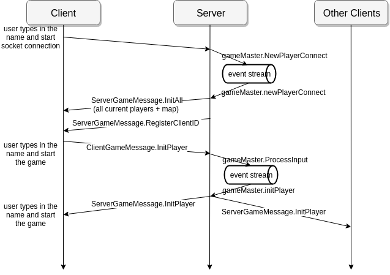
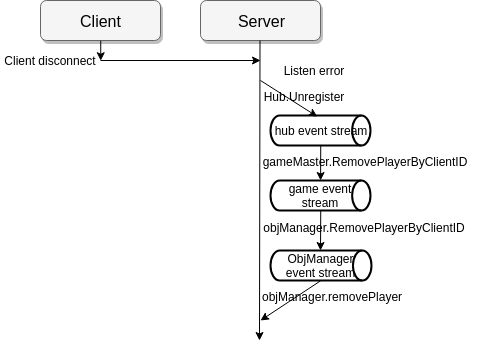
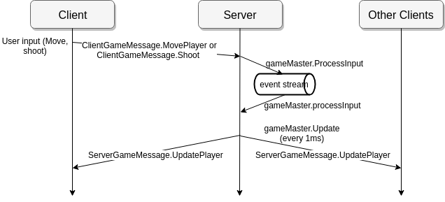

# GOWOG Server

## Summary

Golang based multipler game server. Following Golang concurrency model, the game can tollerate high concurrency throughput.

## Background

Not like webserver when the each requests don't share the state and can have some latency acceptance point. Game server involves modifying sharing memory state to achieve smooth performance.
Golang provides a very elegant solution to solve high concurrency problem by goroutine and channel while still maintaining good running performance.
* Share memory by communication

## Installation

[**In Main page**](..)

This will run web server in the terminal, which listens to port 8080

## Development

### Components
There are mainly 5 entities in the game. Their states are private

| Entity | Private State | Description |
| ------ | ----- | ----------- |
| Client | websocket.Conn | client holds websocket connection. |
| Hub | Client | Hub handles all communication, containing list of all clients. |
| ObjManager | Player, Shoot, ... | ObjManager contains all Player and Shoot, process game logic. |
| Game Master | ObjManager, Hub | Master object consists of ObjManager and Hub. |

### Architecture


Different entities call each other through channel which is wrapped in a function. Golang prevents cycle package dependency, so if a child want to call parent function, parent needs to expose method to child package. For example,IGame interface in Hub package to allow Hub call Game method.

### Client Server sample interaction

Client here is webpage, Server is main backend.

#### Player connect


#### Player Disconnect


#### Client input


### Profile

Profile is the way to investigate Golang performance and figure out the slow components. You can profile the server with flag --cpuprofile, and --memprofile when running server.
`go run cmd/server --cpuprofile --memprofile`

Loadtest will be added soon.

### Code structure

```
├── server
│   ├── cmd
│   │   └── server
│   │       └── server.go: Entrypoint running server
│   ├── game
│   │   ├── common
│   │   ├── config
│   │   │   └── 1.map: Map represented 0 and 1
│   │   ├── gameconst
│   │   ├── game.go: Game master objects, containing logic and communication
│   │   ├── mappkg
│   │   ├── objmanager
│   │   ├── playerpkg
│   │   ├── shape
│   │   ├── shootpkg
│   │   ├── types.go
│   │   └── ws
│   │       ├── wsclient.go
│   │       └── wshub.go
│   ├── generate.sh: Generate protobuf for server + client + AI environment
│   ├── message.proto
│   └── Message_proto
│       └── message.pb.go
├── Dockerfile
└── run_local.sh
```

## Credits

The server websocket design is based on Gorila websocket chat example.
https://github.com/gorilla/websocke/blob/master/examples/chat
